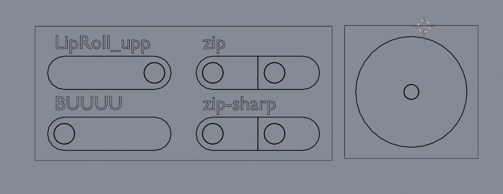
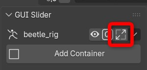
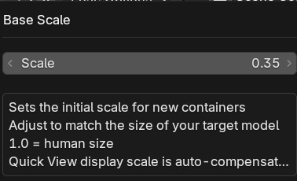
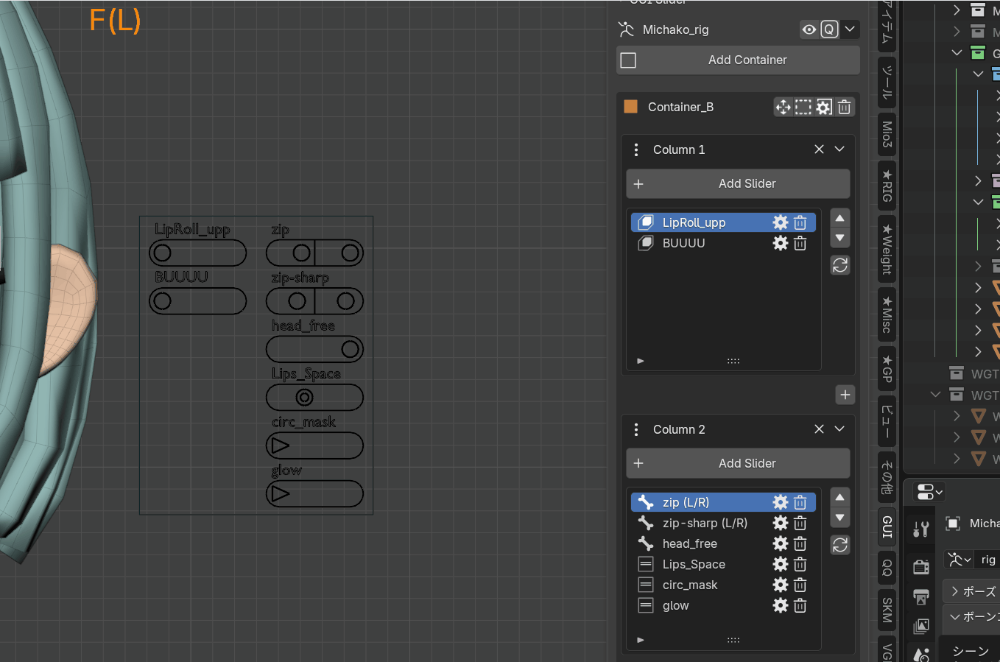

# Containers / Columns

!!! danger "Important"
    **Do not rename the generated bone names or change their hierarchy. The add-on will no longer be able to recognize them correctly.**

## Containers

A container is the box that groups and manages sliders or joysticks.

### Container Types

| Type | Description |
|------|-------------|
| **Slider Container** | Stores horizontal sliders |
| **Joystick Container** | Stores a 2D joystick |

### Container Basics

- You can place multiple containers on a single armature
- Even if the scene contains multiple armatures, each armature can have its own independent set of containers
- A single container can contain only one type: either `Slider` or `Joystick`
- **If the armature object's scale is not `1`, sliders will not display at the correct scale. Apply the scale before use to set it to 1.**
- When you change a container's Scale or Width while keyframes exist, existing keyframes are automatically rescaled to preserve the same output values. The same applies when changing a slider's Range or default value

---

### Base Scale

  
  

- Applied as the default `Container Scale` when creating new containers
- Does not affect existing containers
- Quick View display scale is automatically compensated (containers appear at a consistent size regardless of the scale value)
- `1.0` = sized to sit beside a human face. Adjust to match the size of your target model

!!! warning
    When creating a container with the default value of 1.0 for extremely large objects such as robots, the container will be created at a relatively small size compared to the object. Base Scale compensates for this gap.
    If you are unsure about the scale, create a container at the default 1.0, fine-tune the container size, note the scale value, and then apply it to Base Scale.

### Track Style

| Style | Description |
|-------|-------------|
| **Capsule** | A capsule shape. The standard look |
| **Line** | A thin rectangular line for a simpler look |

### Panel Header Buttons

Buttons at the top-right of the container section in the N panel:

| Button | Description |
|--------|-------------|
| **👁 Toggle All Containers** | Toggles visibility of all containers at once (always forced visible during Quick View) |
| **Q (Quick View)** | Enters Quick View mode |
| **⤢ Base Scale** | Opens the Base Scale settings dialog |
| **▼ Menu** | Opens helper functions such as Cleanup All |

Buttons in each container header row:

| Button | Description |
|--------|-------------|
| **✥ Base Position Edit** | Enters Base Position Edit mode |
| **🔲 Container Wire** | Toggles the container frame wire display |
| **⚙ Settings** | Opens the settings popup |
| **🗑 Delete** | Deletes the container |

### Adjusting Container Position

Use this when you want to adjust a container's base position.

1. Click **Base Position Edit** in the container header to enter **Base Position Edit** mode
2. The container and its related bones are selected automatically
3. Reposition them **without changing the current bone selection**
4. When finished, click **Confirm** to apply the change and return to Pose Mode
5. If you want to discard the edit, click **Cancel** to return

!!! warning
    Moving it this way preserves the adjusted position even after Transform Reset.
    You can also move bones directly in Pose Mode, but this method is recommended for permanent layout adjustments.

### Follow Bone

Follow Bone makes a container follow a specific bone. The container position and orientation automatically react to the target bone's position and rotation.

#### Modes

| Mode | Description |
|------|-------------|
| **OFF** | No follow behavior |
| **Simple** | Follows position and inherits only the specified rotation axes. A lightweight `Child Of` based method |
| **Advanced** | Follows via parent chain (position) + Copy Rotation (selected axes) for accuracy. Uses intermediate bones internally |

#### Follow Rot Axis

`Follow Rot Axis (X / Y / Z)` specifies which rotation axes of the target bone are reflected.

- If all axes are OFF, only the position is followed
- By default, only the Z axis is followed

---

## Columns

Columns let you split sliders into multiple vertical groups inside one container.

### Column Basics

- Up to **8** columns can be added
- Newly added sliders are placed in the currently selected column

For example, you can organize columns by categories such as `Eyes`, `Mouth`, and `Brows`.

### Adding Columns

In the N panel, insert a new column with the **+ button** between columns.

### What You Can Do From the Column Menu

From the pull-down menu in a column header, you can:

- Delete a column
- Move a column
- Rename a column
- Toggle label display for the whole column
