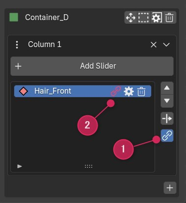
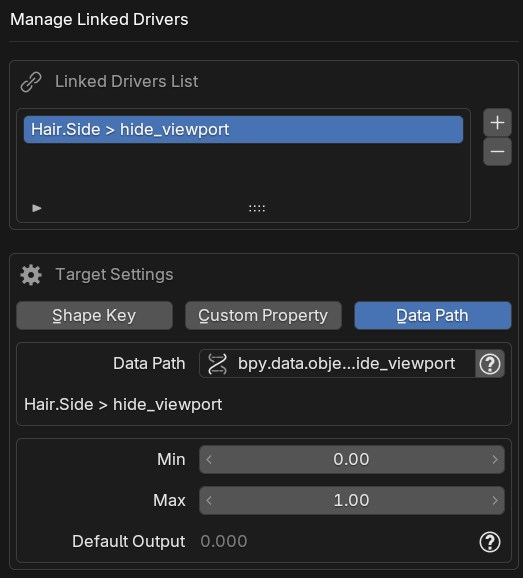

# Linked Driver

Linked Driver lets a single slider drive **multiple targets** at once.

In addition to the driver initially assigned to the slider (the Primary Driver), you can create additional drivers that follow the same slider's movement. This is useful when you want to toggle both `hide_viewport` and `hide_render` with one slider, or control multiple node parameters together.

  
  

## Target Types

The same three target types available for Primary Drivers can be chosen.

| Target Type | Description |
|-------------|-------------|
| **Shape Key** | Shape keys on mesh, curve, or surface objects |
| **Custom Property** | Custom properties on bones |
| **Data Path** | Any property specified by data path |

## Range

Each Linked Driver has its own independent **Range Min / Max**, separate from the Primary Driver.

The slider position is mapped to the Linked range using the same ratio as the Primary Driver.

!!! example
    If the Primary Range is 0–1 and the Linked Range is 10–20, when the slider is at 50% → Primary = 0.5, Linked = 15

### Default Output

The output value of the Linked Driver when the slider is at its default (rest) position. This is automatically calculated from the Primary Driver's default value and the Linked range, so it is read-only.

## Adding and Managing

Select a slider in the N-panel list and click the 🔗 button to open the **Manage Linked Drivers** dialog. Adding, editing, and deleting are all done within this dialog.

- The upper list shows existing Linked Drivers
- **+ button**: Add a new Linked Driver
- **– button**: Remove the selected Linked Driver
- Selecting an item in the list displays its target settings and range below, where they can be edited in place
- Pressing **OK** commits all additions, edits, and deletions at once

## Overwriting Existing Drivers (Force Overwrite)

If the target already has a driver, a warning is displayed.

Enable the "**Overwrite existing driver**" checkbox to remove the existing driver and replace it with the Linked Driver.

!!! warning
    Overwriting permanently removes the existing driver. Be careful not to lose drivers unintentionally.

## Notes

- Linked Driver is **slider-only**. Joystick is not supported
- Changing the Primary Driver's range or default value automatically recalculates all Linked Driver expressions
- Deleting a slider that has Linked Drivers also removes all its Linked Drivers
