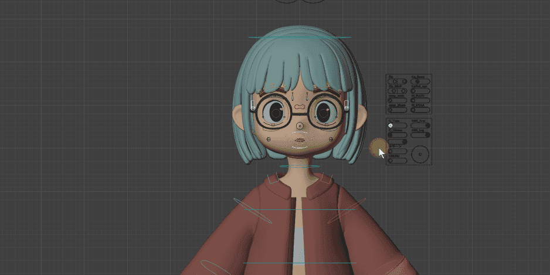
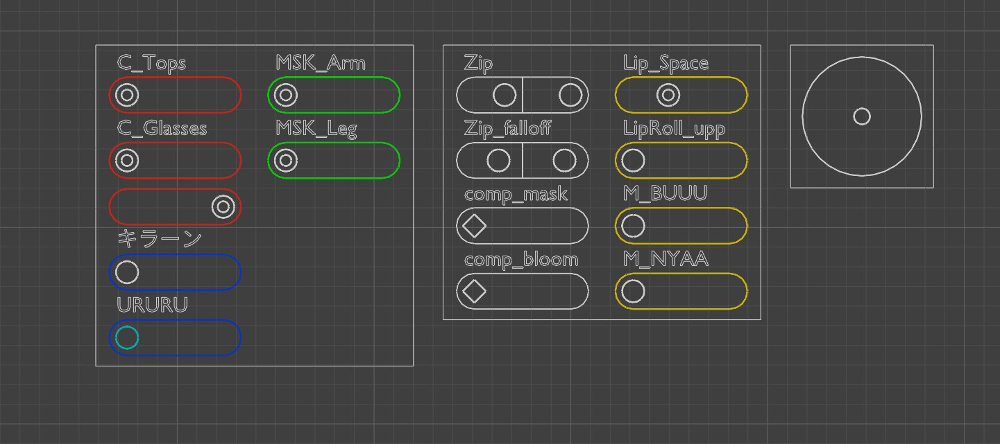

# Quick View

Quick View is a mode that arranges all containers in a **grid facing the viewport** for easy overview and adjustment. When you exit, the original container positions and orientations are restored.

---

## Start and Exit

### Start

- The Quick View button in **N Panel > GUI tab**
- The **Q** button in the **tool header** while in Pose Mode
- Keyboard shortcut: `C`

### Exit

- The **Exit Quick View** button
- The **Exit Quick View** button in the tool header
- Keyboard shortcut: `C`

!!! note
    `C` works as a toggle. It exits Quick View when already active, and starts it when you are in normal mode.

---

## Layout

### Layout Parameters

| Parameter | Description |
|-----------|-------------|
| **Scale** | Overall scale multiplier for the grid |
| **H Gap** | Horizontal spacing between containers |
| **V Gap** | Vertical spacing between containers |
| **Max Columns** | Maximum number of columns in the grid |
| **Offset X / Y** | Offset from the top-left of the viewport |
| **Wire Scale** | Wire width scale factor during Quick View |
| **Fade Geometry** | Gray intensity of objects during Quick View |

!!! note
    Even if all containers are hidden in normal mode, Quick View forces them to be shown. This lets you keep them hidden most of the time and only use Quick View while adjusting them.

---

## Display Options

| Option | Description |
|--------|-------------|
| **Auto Tweak Tool** | Automatically switches to the Tweak tool and restores the previous tool when Quick View ends |
| **Show Container Wire** | Shows the outer wire frame of the containers |
| **Hide Non-GUI Bones** | Hides bones other than GUI bones for a cleaner view |
| **Local View** | Enters local view showing only the armature and its associated objects |
| **Highlight Sliders** | Highlights slider bones. Choose from color presets via the color icons |
| **Mark** | Marks the selected slider with a color to make it stand out. Press the same color again to remove the mark |

!!! warning
    **Highlight Sliders** uses **Theme Color Set 20** internally. If you have custom colors set in Color Set 20, they will be overwritten while Quick View is active (they are restored on exit).

---

## Preferences

| Setting | Description |
|---------|-------------|
| **Show Quick View Button in Header** | Shows the Quick View button in the tool header |
| **Show Color Icons in Header** | Shows highlight and mark color icons in the tool header |
| **Auto Switch to GUI Tab** | Automatically switches to the GUI tab when Quick View starts, then returns to the previous tab when it ends |

---

## Notes

!!! warning
    If you enter Quick View via Undo, the N panel layout parameters cannot be used. In that case, exit the mode once and then enter Quick View again.
