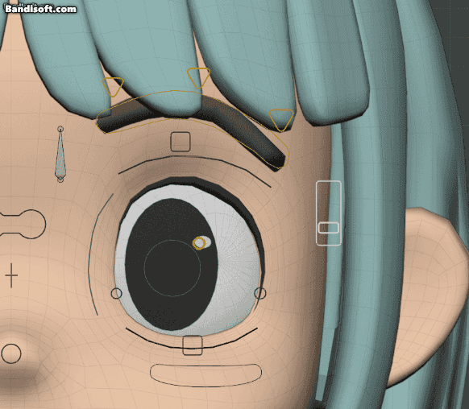
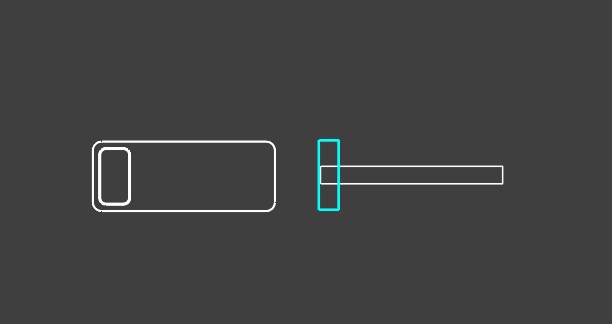

# Dual Controller

Dual Controller は、既存ボーンに **追加のサブコントローラー** を付ける機能。通常のスライダーとは別に、補助的な 1D / 2D コントローラーを追加できる。

---

## 追加方法

1. Dual Controller を追加したいボーンを選択する
2. **N パネル > GUI タブ > Dual Controller** を開く
3. **Add Dual Controller** を実行する
4. **Type** で `Slider` または `Joystick` を選ぶ
5. 必要に応じて、Track Style、Direction、Mapping などの初期設定を調整する
6. 作成後、各方向または各軸のターゲットを設定する

!!! warning "注意"
    Dual Controller は選択中のボーンの子として追加される。

---

## タイプ

| タイプ | 説明 |
|--------|------|
| **Dual Slider** | ライン型またはボックス型の 1D コントローラーを追加 |
| **Dual Joystick** | 円形の 2D コントローラーを追加 |

---

## Dual Slider

### トラックスタイル

Dual Slider では、見た目と移動方向を選択可能。

- **スタイル:** Box / Line

- **方向:** Horizontal / Vertical

### ミラー

反対側のボーンに Dual Controller を複製する機能。L/R ペアのボーンがある場合に表示される。

!!! warning "注意"
    ターゲットタイプが Data Path の場合、ミラー機能は使えない。

### L/R Sync

Horizontal の Dual Slider で、L/R ペアのボーンがある場合に表示される。有効にすると、Blender の **X-Axis Mirror** が ON のときに L/R のコントロールが連動する。

!!! warning "注意"
    L/R Sync を有効にすると、R 側のスライダーは操作方向が逆になる。

!!! note "補足"
    Vertical では影響がないため、このオプションは表示されない。

---

## Dual Joystick

### マッピングモード

| モード | 説明 |
|--------|------|
| **Omni** | 中心からの距離で単一ターゲットを駆動。方向に関係なく、ハンドルが中心から離れるほど値が大きくなる |
| **4-Way** | 上下左右がそれぞれ異なるターゲットを駆動。通常のジョイスティックコンテナと同じ動作 |

### オプション

- **Clamp Inner** — ON にすると内円が外円の範囲にクランプされる

---

## 補足

### 位置調整

**Position (X / Y / Z)** で Dual Controller の配置オフセットを調整可能。Scaled モードを ON にすると値が 100 倍スケールで表示され、微調整しやすくなる。
