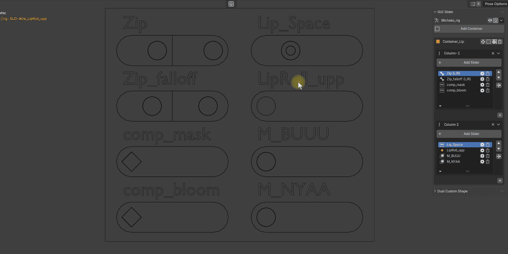
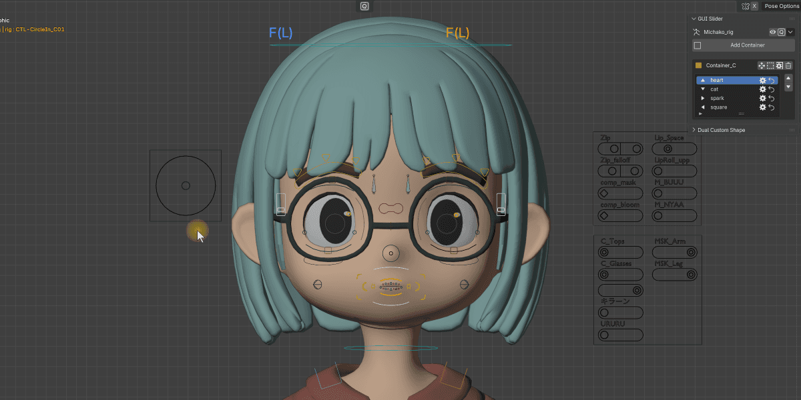

# スライダー / ジョイスティック

## スライダー

スライダーは、1つのターゲットを操作する 1D コントローラー。

!!! note "補足"
    スライダーのターゲットタイプは作成時のものから変更不可。

### ターゲットタイプ

#### Shape Key

メッシュオブジェクトの **シェイプキー値** を制御する。

#### Custom Property

ボーンの **カスタムプロパティ** を制御する。

- 対象はボーンのカスタムプロパティのみ
- 指定したカスタムプロパティが存在しない場合は、**自動的に作成** される

#### Data Path

Blender の **任意のプロパティ** をデータパスで指定して制御する。最も柔軟なターゲットタイプ。

Blender 上でプロパティを右クリックし、**Copy Full Data Path** で取得したパスを入力する。数値型プロパティ（float / int / bool）に対応。

!!! warning "注意"
    文字列プロパティや、右クリックメニューに「Add Driver」が表示されないプロパティには対応していない。

### プロパティの右クリックから追加

数値プロパティなら、データパスをコピーして貼り付ける代わりに、プロパティを右クリックして直接スライダーを作成できる。

1. 操作したいプロパティを右クリックする
2. **GUIスライダーを追加** を選ぶ
3. 作成先のコンテナを選び、必要ならスライダー名を入力して **OK** を押す

**詳細設定を開く** を ON にすると、対象プロパティをあらかじめ入力した通常の Add Slider ダイアログを開ける。範囲や外観を作成前に細かく設定したい場合に使う。

既存のスライダーへ同じ操作量で別のプロパティを追加したい場合は、右クリックメニューの **リンクGUIスライダーを追加** を選ぶ。接続する既存スライダーと出力範囲を選ぶと、Linked Driver として追加される。

!!! note "表示条件"
    これらの項目は、Blender 標準の右クリックメニューに **Add Driver** が表示されるプロパティでのみ表示される。

### ミラー

#### Shape Key ミラー

L/R サフィックスを基にミラーペアを自動生成する。1つのトラックは半分に分割され、画面上では左側に R、右側に L が配置される。

- 例: `smile.L` ↔ `smile.R`

#### Custom Property ミラー

ターゲットボーン名の `.L` / `.R` サフィックスでペアリングする。

- 例: `c_hand_ik.l` → ミラー先 `c_hand_ik.r`（プロパティ名は共通）
- プロパティ名にも L/R サフィックスがある場合は自動的にミラーされる

!!! warning "注意"
    ミラーは **Shape Key** と **Custom Property** のみ対応。Data Path とジョイスティックでは使用できない。
    対応サフィックス: `.L/.R`, `_L/_R`, `-L/-R`（大文字小文字不問）

### 外観

- **ハンドル形状:** Circle / Arrow / Square / Diamond
- **高さ:** L / M / S の3段階
- **トラックスタイル:**

| スタイル | 説明 |
|---------|------|
| **Capsule** | カプセル型の丸いレール |
| **Line** | 細線レール。ハンドルは縦長長方形 |

### キーイング除外

**Keying Excluded** を ON にすると、スライダーボーン名は `GEO-` プレフィックスに切り替わる。ハンドル形状は二重線の特別なアイコンに変わり、視覚的に区別可能。

この設定でキー挿入対象から除外されるのは、次のキーイングセットのみ。

- キャラクター全体
- キャラクター全体（選択中のボーンのみ）

!!! warning "注意"
    自動キーが ON の状態でスライダーを動かすと、上記のキーイングセットを指定していてもキーフレームが挿入される。完全に除外したい場合は、Blender の **Preferences > Animation > Only Insert Available** を ON にする必要がある。

### 順序変更

N パネルのリストでスライダーの表示順序を管理可能。

1. リスト内のスライダーを選択（3Dビューのボーン選択と連動）
2. **UP / DOWN ボタン** で順序を上下に移動
3. **Apply Order** ボタンで並び替えを確定

!!! note "補足"
    `Relocate Slider` のボタンは各カラムのスライダーリスト横に表示され、別カラムや別コンテナへの移動に使う。リスト表示が Undo / Redo 後にズレた場合は、**Reload** ボタンで再同期可能。

---

## ジョイスティック

ジョイスティックは、円形の 2D コントローラー。4方向（上下左右）にそれぞれ異なるターゲットを割り当て可能。

- 外円がハンドルの移動制限範囲
- 内側のハンドルをドラッグして操作
- 上下左右方向に対して、個別にターゲットを設定可能

### 方向ごとのターゲット設定

各方向（Up / Down / Right / Left）ごとに、ターゲットタイプを設定可能。方向ごとに Range Min / Max を指定でき、それぞれ独立した値範囲を持てるが、**デフォルト値は常に0**。

!!! warning "注意"
    ジョイスティックにはミラー機能とキーイング除外機能はない。
